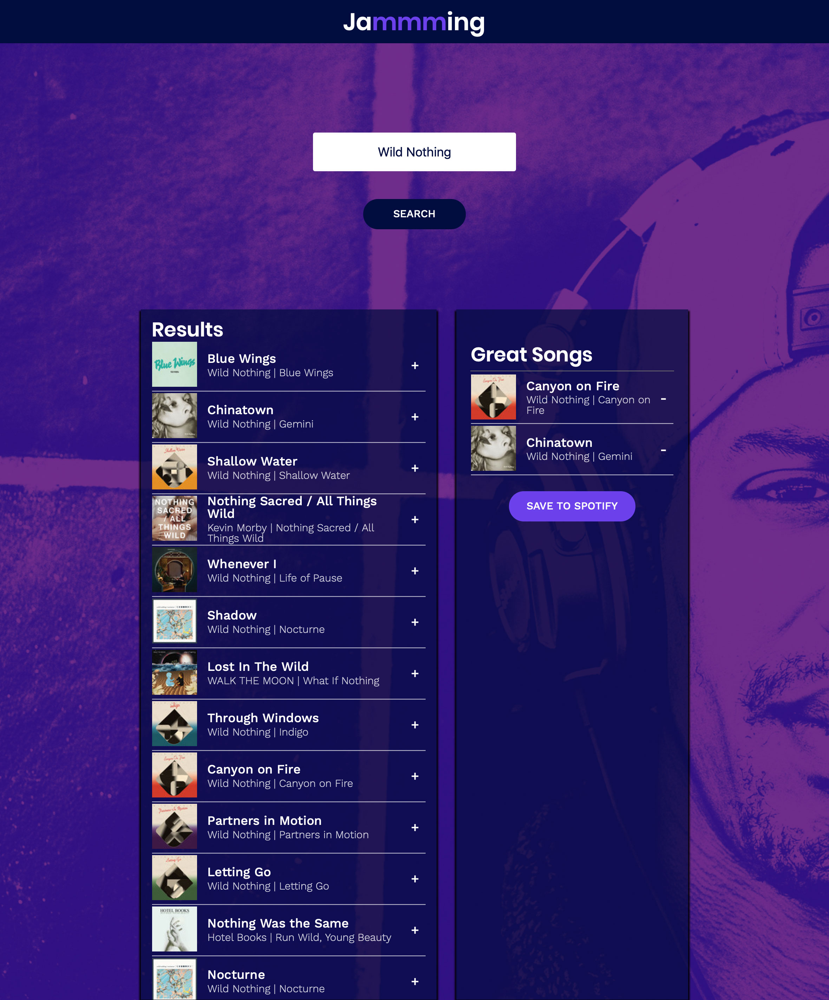

# Jammming #
A project for demonstrating my new knowledge of React.

Jammming is a web app that allows uers to search the Spotify library, create a custom playlist, and save the playlist to their Spotify account.

[View Demo](http://jammming.bg.surge.sh).

## Features ##
* Spotify login
* Search by song, album, or artist
* Display search results
* Add tracks from search results to a custom playlist
* Remove tracks from the custom playlist
* Change playlist title
* Save playlist to account

## How to Run ##
Run `npm start`.